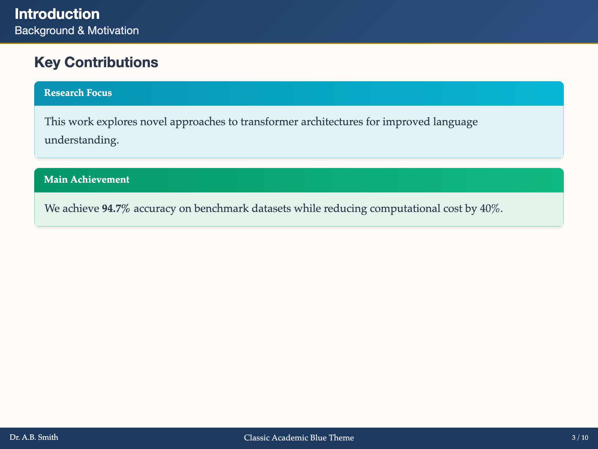
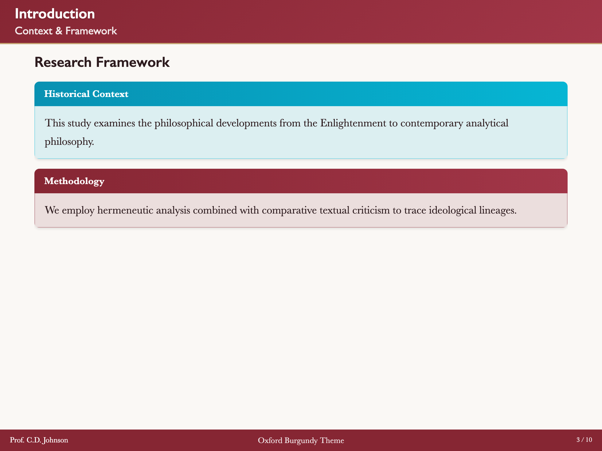
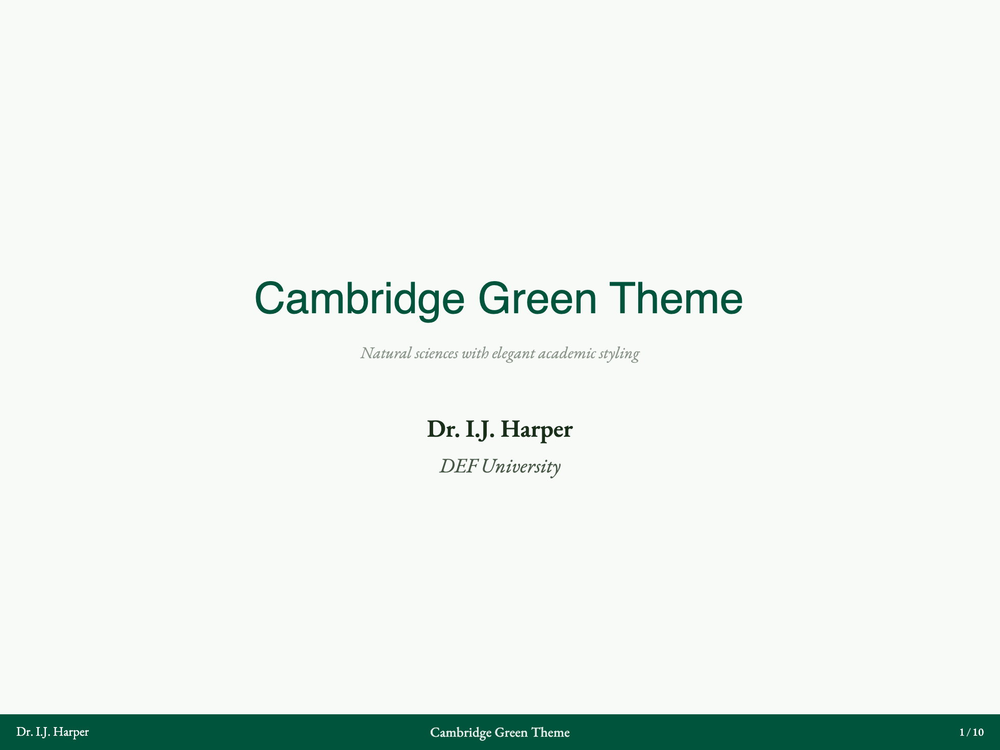
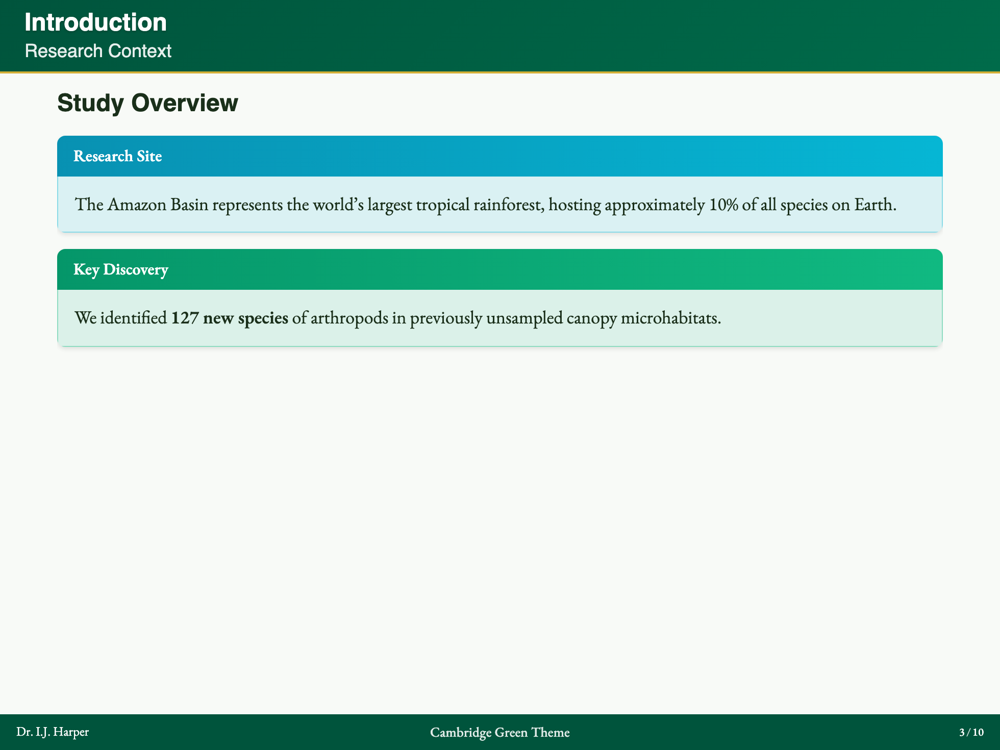
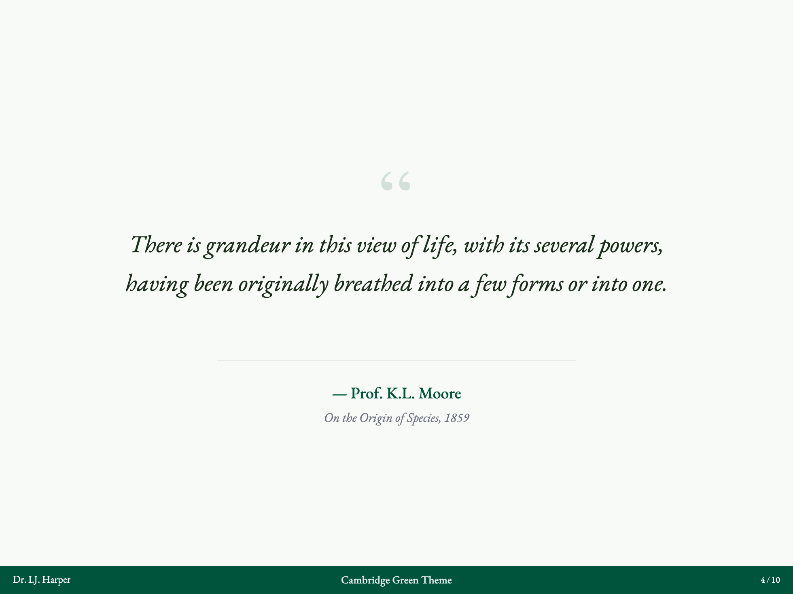

# Slidev Theme Scholarly

<p align="center">
  <a href="https://www.npmjs.com/package/slidev-theme-scholarly">
    
  </a>
  <a href="https://www.npmjs.com/package/slidev-theme-scholarly">
    
  </a>
  <a href="https://marketplace.visualstudio.com/items?itemName=jxpeng98.slidev-scholarly-snippets">
    
  </a>
  <a href="https://www.npmjs.com/package/slidev-theme-scholarly/v/next">
    
  </a>
</p>

<p align="center">
  <a href="https://github.com/jxpeng98/slidev-theme-scholarly/issues">
    
  </a>
  <a href="https://github.com/jxpeng98/slidev-theme-scholarly/pulls">
    
  </a>
  <a href="https://github.com/jxpeng98/slidev-theme-scholarly">
    
  </a>
  <a href="./LICENSE">
    
  </a>
</p>

[中文版](./README-zh.md) · [Live Demo](https://scholarly.jxpeng.dev/) · [Documentation](https://scholarly-docs.jxpeng.dev/en/)

A professional presentation theme for [Slidev](https://sli.dev), designed specifically for academic presentations with LaTeX Beamer-inspired styling.

> **⚠️ Major Upgrade in Progress**
>
> Upcoming versions may include breaking changes. Please check the [Upgrade Notes](https://scholarly-docs.jxpeng.dev/en/guide/upgrade.html) before updating.
>
> **Try the pre-release:**
> ```bash
> npm i -D slidev-theme-scholarly@next
> ```

---

## ✨ Key Features

| Feature | Description |
|---------|-------------|
| 🎓 **Professional Design** | LaTeX Beamer-inspired with academic styling |
| 📐 **34 Layouts** | Structure, Content, Emphasis, and Academic categories |
| 🧩 **Rich Components** | Theorem, Block, Citations, Metrics, Evidence, Paper Cards, Lists |
| 🎨 **9 Color Themes** | Classic Blue, Oxford, Cambridge, Yale, Princeton, Nordic, Monochrome, Sepia, High Contrast |
| 🌓 **Explicit Surface Modes** | Separate `contentMode`, `chromeMode`, and `sectionMode` controls |
| 📚 **Citations & Footnotes** | BibTeX bibliography plus academic Markdown footnotes with inline preview |
| 📝 **Syntax Sugar** | Simplified Markdown directives for components |
| 🔧 **VS Code Extension** | Snippets, previews, and BibTeX integration |

---

## 🚀 Quick Start

### Requirements

Install Node.js 20 or newer.

### Create with CLI (Recommended)

Use the package name for a one-time `npx` run:

```bash
npx -y slidev-theme-scholarly init my-talk --template academic
cd my-talk
pnpm install
pnpm run dev
```

`npx` must download the CLI code before it can run it. When the package is not
already available locally, npm installs it into its cache, not into your project
or global packages. The `-y` flag accepts that temporary cache installation
without an interactive prompt.

List the available templates without creating a project:

```bash
npx -y slidev-theme-scholarly template list
```

Generated starters work out of the box with Scholarly's built-in citation support. Normal theme usage does not require a project-level `vite.config`.

### Use the Project-Local CLI

Generated projects already declare Scholarly as a development dependency. For
an existing Slidev project, install it first:

```bash
pnpm add -D slidev-theme-scholarly
```

Then run the short `sch` binary through the project package manager:

```bash
pnpm exec sch --version
```

With npm, use `npm i -D slidev-theme-scholarly` and `npx sch`. The `sts` and
`scholarly` binaries are aliases of `sch`.

Common commands:

```bash
# show help
pnpm exec sch help
pnpm exec sch help theme

# list Scholarly presets and assets
pnpm exec sch theme list
pnpm exec sch layout list
pnpm exec sch component list
pnpm exec sch snippet list

# apply Scholarly visual preset to slides frontmatter
pnpm exec sch theme apply oxford-burgundy --font traditional --file slides.md
pnpm exec sch theme preset apply oxford --file slides.md

# append academic snippet blocks into slides
pnpm exec sch snippet append theorem --file slides.md
pnpm exec sch snippet append references --file slides.md

# append full scholarly workflow skeleton
pnpm exec sch workflow list
pnpm exec sch workflow apply paper --file slides.md

# generate a paper summary from BibTeX
pnpm exec sch paper summary --bib references.bib --key sample2026

# check environment and project readiness (includes Scholarly checks)
pnpm exec sch doctor
pnpm exec sch doctor --json
```

### Optional Global CLI

A global install is not required, but it makes the short binaries available
outside a project:

```bash
npm i -g slidev-theme-scholarly
sch template list
# aliases: sts, scholarly
```

### Create Manually

```markdown
---
theme: scholarly
authors:
  - name: Your Name
    institution: Your University
themeConfig:
  colorTheme: classic-blue
  chromeMode: dark
  sectionMode: dark
footerMiddle: Conference 2026
---

# Your Presentation Title

Subtitle or description

---

# Introduction

- Point 1
- Point 2
- Point 3
```

BibTeX citations and the `references` layout work automatically once the theme is enabled. Use `layout: references` for a generated bibliography slide, or add `[[bibliography]]` only when you need custom placement inside that slide.

### Preview

```bash
npx slidev
```

---

## 📐 Layouts

Layouts are organized into **four categories**:

### Structure Layouts

| Layout | Description |
|--------|-------------|
| `cover` | Title slide with authors |
| `default` | Standard content slide |
| `intro` | Section introduction |
| `section` | Chapter divider |
| `center` | Centered content |
| `auto-center` | Auto-centered content |
| `auto-size` | Default flow with fit-to-page sizing |
| `end` | Closing slide |

### Content Layouts

| Layout | Description |
|--------|-------------|
| `two-cols` | Two-column layout |
| `image-left` | Image on left, text on right |
| `image-right` | Image on right, text on left |
| `bullets` | Enhanced bullet list |
| `figure` | Academic figure with caption |
| `split-image` | Split image layout |

### Emphasis Layouts

| Layout | Description |
|--------|-------------|
| `quote` | Styled quotation |
| `fact` | Single fact/statistic |
| `statement` | Important statement |
| `focus` | Focused statement with icon |

### Academic Layouts

| Layout | Description |
|--------|-------------|
| `compare` | Side-by-side comparison |
| `methodology` | Research methodology |
| `results` | Research results |
| `timeline` | Timeline visualization |
| `agenda` | Presentation agenda |
| `acknowledgments` | Acknowledgments |
| `references` | Bibliography |

[View Layout Documentation →](https://scholarly-docs.jxpeng.dev/en/layouts/structure.html)

---

## 🧩 Components

| Component | Description | Example |
|-----------|-------------|---------|
| **Theorem** | Theorems, lemmas, definitions | `<Theorem type="theorem">...</Theorem>` |
| **Block** | Beamer-style info blocks | `<Block type="info">...</Block>` |
| **Citations** | BibTeX citations | `@citekey` or `!@citekey` |
| **Steps** | Process visualization | `<Steps :steps="[...]" />` |
| **Keywords** | Keyword tags | `<Keywords :keywords="[...]" />` |
| **Columns** | Multi-column layout | `<Columns :columns="2">...</Columns>` |
| **Highlight** | Text highlighting | `<Highlight>text</Highlight>` |

[View Component Documentation →](https://scholarly-docs.jxpeng.dev/en/components/index.html)

---

## 🎨 Theme Gallery

<details open>
<summary><b>Classic Blue (Default)</b></summary>
<table>
  <tr>
    <td></td>
    <td></td>
    <td></td>
    <td></td>
  </tr>
</table>
</details>

At the top of each slide, add:
<details>
<summary><b>Oxford Burgundy</b></summary>
<table>
  <tr>
    <td></td>
    <td></td>
    <td></td>
    <td></td>
  </tr>
</table>
</details>

<details>
<summary><b>Cambridge Green</b></summary>
<table>
  <tr>
    <td></td>
    <td></td>
    <td></td>
    <td></td>
  </tr>
</table>
</details>

<details>
<summary><b>More Themes...</b></summary>

- Yale Blue
- Princeton Orange
- Nordic Blue
- Monochrome
- Warm Sepia
- High Contrast

[View All Themes →](https://scholarly-docs.jxpeng.dev/en/guide/themes.html)
</details>

**Use for:** Most of your slides (this is automatic!)

---

## 🔧 VS Code Extension

Boost your productivity with our VS Code extension:

- 🎯 Secondary Side Bar panel for layouts/components
- ✨ Snippets: type `ss-` to insert layouts/components
- ⚡ Smart completion for `layout:`, `themeConfig`, `<components>`, and `:::` directives
- 📚 BibTeX integration with auto-complete
- 👁️ **Visual Previews**: Directly preview layouts, components, and themes in the sidebar

[Download from Releases →](https://github.com/jxpeng98/slidev-theme-scholarly/releases)

---

## 🤝 Contributing

We welcome contributions!

```bash
# Install dependencies
pnpm install

# Start development server
pnpm run dev

# Build
pnpm run build
```

[View Contributing Guide →](https://scholarly-docs.jxpeng.dev/en/contributing.html)

---

## 📄 License

MIT License - see [LICENSE](./LICENSE) for details.

---

## 🙏 Credit

Slidev Theme Scholarly draws visual inspiration from
[LaTeX Beamer](https://ctan.org/pkg/beamer). Thanks to the
[linux.do community](https://linux.do/) for practical AI tooling discussions
and feedback.

---

## 🔗 Links

- [📖 Documentation](https://scholarly-docs.jxpeng.dev/en/)
- [🎬 Live Demo](https://scholarly.jxpeng.dev/)
- [🐛 Issues](https://github.com/jxpeng98/slidev-theme-scholarly/issues)
- [💬 Discussions](https://github.com/slidevjs/slidev/discussions)
- [📦 NPM Package](https://www.npmjs.com/package/slidev-theme-scholarly)

---
