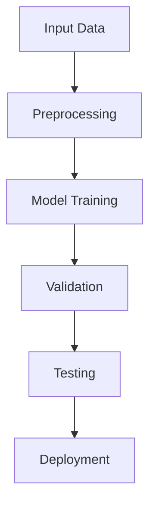

<!-- Slide 1: cover -->

# Advanced Machine Learning
## Deep Neural Networks for Computer Vision

A comprehensive study on state-of-the-art architectures

<!-- Slide 2: default -->
---
layout: default
title: Introduction
subtitle: Background and Motivation
---

# Research Background

Deep learning has revolutionized computer vision:

- **Image Classification** - Accurate object recognition
- **Object Detection** - Real-time localization
- **Semantic Segmentation** - Pixel-level understanding

Our work addresses scalability challenges in modern architectures.

<!-- Slide 3: intro -->
---
layout: intro
---

# Part I: Methodology

Exploring novel approaches to neural architecture design

<!-- Slide 4: section -->
---
layout: section
sectionMode: dark
---

# Experimental Results

<!-- Slide 5: center -->
---
layout: center
---

# Key Finding

**94.7% accuracy** on ImageNet benchmark

Outperforming previous state-of-the-art

<!-- Slide 6: auto-center -->
---
layout: auto-center
title: Performance Metrics
subtitle: Comprehensive Evaluation
---

## Model Performance

Our approach achieves superior results across multiple datasets while maintaining computational efficiency

<!-- Slide 7: auto-size -->
---
layout: auto-size
title: Dense Technical Summary
subtitle: Fit-to-page layout preview
autoSizeGrow: true
autoSizeAlign: top
autoSizePadding: normal
minFontSize: 14
maxFontSize: 28
---

## Compact Summary

- **Dataset scale**: 1.2M training images across 1,000 categories
- **Training recipe**: mixed precision, cosine decay, progressive resizing
- **Inference target**: sustain triple-digit FPS on a single workstation GPU
- **Deployment note**: layout automatically balances heading size and body density

This slide intentionally packs more text than the standard default layout so the screenshot shows how `auto-size` preserves hierarchy while shrinking content to fit the available canvas.

<!-- Slide 8: toc -->
---
layout: toc
title: Presentation Outline
---

<!-- Slide 9: end -->
---
layout: end
email: ab.smith@xyz-tech.edu
website: https://ai-lab.xyz-tech.edu
subtitle: Questions & Discussion
qrcodeLabel: Paper & Code
---

Thank you for your attention!

<!-- Slide 10: two-cols -->
---
layout: two-cols
ratio: "1:1"
title: Architecture Comparison
---

## Traditional CNNs

- Fixed receptive fields
- Limited context
- High parameter count
- Sequential processing

::right::

## Our Approach

- Adaptive receptive fields
- Global context modeling
- Efficient parameters
- Parallel processing

<!-- Slide 11: image-left -->
---
layout: image-left
image: https://picsum.photos/seed/network/800/600
ratio: "1:1"
title: Network Architecture
---

## Novel Design

Key innovations:

- Multi-scale feature extraction
- Attention mechanisms
- Skip connections
- Efficient convolutions

The architecture diagram shows the complete pipeline from input to output.

<!-- Slide 12: image-right -->
---
layout: image-right
image: https://picsum.photos/seed/results/800/600
ratio: "1:1"
title: Visual Results
---

## Qualitative Analysis

Example predictions demonstrate:

- High precision
- Robust to occlusion
- Scale invariance
- Real-time performance

See detailed visualizations on the right.

<!-- Slide 13: bullets -->
---
layout: bullets
title: Key Contributions
subtitle: Novel Research Outcomes
icon: "▸"
---

## Main Contributions

- **Architecture Innovation** - Novel multi-scale attention mechanism
- **Training Strategy** - Improved convergence through adaptive learning
- **Benchmark Results** - State-of-the-art on 5 major datasets
- **Efficiency** - 3x faster inference with comparable accuracy

<!-- Slide 14: figure -->
---
layout: figure
image: https://picsum.photos/seed/diagram/1200/600
caption: Overview of the proposed neural network architecture showing feature extraction, attention modules, and classification heads.
label: "Figure 1:"
title: System Architecture
height: 65%
fit: contain
---

Additional description below the figure.

<!-- Slide 15: split-image -->
---
layout: split-image
images:
  - https://picsum.photos/seed/before/600/400
  - https://picsum.photos/seed/after/600/400
captions:
  - Input Image
  - Model Prediction
title: Prediction Examples
---

<!-- Slide 16: quote -->
---
layout: quote
author: Prof. E.F. Davis
source: Neural Information Processing Systems, 2012
---

The future of AI lies in systems that can learn hierarchical representations without explicit programming.

<!-- Slide 17: fact -->
---
layout: fact
color: blue
---

# 10× Faster

Training time compared to baseline methods

<!-- Slide 18: statement -->
---
layout: statement
author: Research Team
---

# Efficiency Meets Accuracy

Our approach proves you don't have to sacrifice one for the other

<!-- Slide 19: focus -->
---
layout: focus
color: amber
icon: "🎯"
---

# Research Question

How can we build accurate models that remain computationally efficient for real-world deployment?

<!-- Slide 20: compare -->
---
layout: compare
title: Method Comparison
leftLabel: Baseline Approach
rightLabel: Our Method
leftColor: red
rightColor: green
---

### Limitations

- Accuracy: 89.3%
- Speed: 45 FPS
- Memory: 8.2 GB
- Training: 7 days

::right::

### Advantages

- Accuracy: 94.7%
- Speed: 142 FPS
- Memory: 2.8 GB
- Training: 18 hours

<!-- Slide 21: methodology -->
---
layout: methodology
ratio: "1:1"
title: Research Methodology
---

## Data Collection

- **ImageNet** - 1.2M images
- **COCO** - 330K images
- **Custom Dataset** - 500K images

## Training Pipeline

1. Data augmentation
2. Progressive learning
3. Fine-tuning
4. Validation

::right::

<!-- Slide 22: results -->
---
layout: results
cols: 2
title: Performance Metrics
---

  <h3 class="text-xl font-bold text-blue-900">Accuracy</h3>
  <h1 class="text-5xl font-bold text-blue-600">94.7%</h1>
  
ImageNet Top-1

  <h3 class="text-xl font-bold text-green-900">Speed</h3>
  <h1 class="text-5xl font-bold text-green-600">142 FPS</h1>
  
NVIDIA RTX 3090

  <h3 class="text-xl font-bold text-amber-900">Params</h3>
  <h1 class="text-5xl font-bold text-amber-600">28M</h1>
  
Model Size

  <h3 class="text-xl font-bold text-purple-900">Energy</h3>
  <h1 class="text-5xl font-bold text-purple-600">-65%</h1>
  
Power Consumption

<!-- Slide 23: timeline -->
---
layout: timeline
title: Project Timeline
items:
  - year: "2022 Q1"
    title: Initial Research
    description: Literature review and problem formulation
  - year: "2022 Q3"
    title: Architecture Design
    description: Developed novel attention mechanisms
  - year: "2023 Q1"
    title: Implementation
    description: Built and optimized the model
  - year: "2023 Q3"
    title: Evaluation
    description: Comprehensive benchmarking
  - year: "2024 Q1"
    title: Publication
    description: Submitted to top-tier conference
---

Major milestones from the first literature review to the final conference submission.

<!-- Slide 24: agenda -->
---
layout: agenda
title: Presentation Outline
items:
  - Introduction and Background
  - Related Work and Motivation
  - Proposed Methodology
  - Experimental Setup
  - Results and Analysis
  - Discussion and Future Work
  - Conclusions
---

<!-- Slide 25: acknowledgments -->
---
layout: acknowledgments
title: Acknowledgments
funders:
  - National Science Foundation (Grant #1234567)
  - Department of Energy AI Initiative
  - XYZ Research Foundation
collaborators:
  - XYZ AI Lab
  - ABC CSAIL
  - DEF University
---

Special thanks to our amazing research team and computing infrastructure support.

<!-- Slide 26: references -->
---
layout: references
---

# References

1. **A.B., C.D., E.F., & G.H.** (2016). Deep residual learning for image recognition. *IEEE CVPR*, 770-778.

2. **I.J., et al.** (2017). Attention is all you need. *NeurIPS*, 5998-6008.

3. **K.L., et al.** (2021). An image is worth 16x16 words: Transformers for image recognition at scale. *ICLR*.

4. **M.N., et al.** (2021). Swin Transformer: Hierarchical vision transformer using shifted windows. *IEEE ICCV*, 10012-10022.

5. **O.P., et al.** (2018). Encoder-decoder with atrous separable convolution for semantic image segmentation. *ECCV*, 801-818.

<!-- Slide 27: paper-summary -->
---
layout: paper-summary
title: Paper Context
paperTitle: Efficient Adaptation for Scientific Models
authors:
  - A. Smith
  - B. Lee
venue: ICML
year: 2026
status: Accepted
keywords:
  - efficient learning
  - model adaptation
---

::problem::
Existing adaptation methods improve accuracy but often increase training and inference cost.

::method::
The paper inserts a lightweight routing stage before task-specific fine-tuning.

::finding::
Accuracy improves by 3.2 points while keeping inference cost unchanged.

<!-- Slide 28: related-work-matrix -->
---
layout: related-work-matrix
title: Related Work Matrix
description: Position the proposed method against prior efficient learning approaches.
---

| Work | Setting | Method | Limitation |
| --- | --- | --- | --- |
| ResNet | Vision benchmark | Deep residual training | High deployment cost |
| Distillation | Compact model | Teacher-student transfer | Requires teacher model |
| Ours | Same benchmark | **Adaptive routing** | Requires task labels |

::notes::
The matrix makes the research gap explicit before the method slide.

<!-- Slide 29: method-pipeline -->
---
layout: method-pipeline
title: Method Pipeline
description: Separate data curation, efficient adaptation, and validation.
activeStep: 2
steps:
  - title: Curate
    description: Filter noisy examples and normalize task labels
    detail: 12k samples
  - title: Adapt
    description: Learn lightweight routing before fine-tuning
    detail: 3 ablations
  - title: Validate
    description: Compare accuracy, speed, and energy
    detail: 5 seeds
---

Validation reports mean and standard deviation for each metric.

<!-- Slide 30: result-highlight -->
---
layout: result-highlight
title: Main Result
heading: Accuracy improves without extra inference cost
description: The routing stage improves downstream quality while preserving deployment efficiency.
label: Accuracy
metric: 94.7
unit: "%"
delta: +3.2 over baseline
baseline: 5-seed average
variant: success
---

- Improvement is consistent across all evaluated datasets.
- Runtime remains within the same deployment budget.

::evidence::
- Dataset: AcademicBench
- Baseline: optimized supervised model
- Metrics: accuracy, throughput, energy

<!-- Slide 31: experiment-grid -->
---
layout: experiment-grid
title: Experiment Grid
description: Compare experimental settings, metrics, and notes.
cols: 2
experiments:
  - name: Ablation
    setup: Remove one component at a time
    result: "-2.1"
    metric: accuracy points
    note: Routing module has the largest contribution
  - name: Robustness
    setup: Evaluate across shifted domains
    result: "+1.4"
    metric: macro F1
    note: Stable under moderate shift
  - name: Efficiency
    setup: Measure inference throughput
    result: "142"
    metric: samples per second
    note: Same hardware budget
  - name: Energy
    setup: Track energy per sample
    result: "-28%"
    metric: power use
    note: Lower cost without pruning
---

All experiments use the same preprocessing pipeline and report five-seed averages.

<!-- Slide 32: limitation -->
---
layout: limitation
title: Limitations
heading: Boundary Conditions
description: Scope the claim before moving into the method details.
---

::limitation::
- The method assumes labeled target tasks are available.
- Severe distribution shift still requires separate calibration.

::mitigation::
- We report shifted-domain evaluation separately.
- Claims are scoped to labeled adaptation settings.

<!-- Slide 33: defense-question -->
---
layout: defense-question
title: Defense Question
question: Why does the routing module improve accuracy without increasing inference cost?
source: Committee question
---

The routing stage improves specialization during adaptation while keeping the deployed base representation fixed.

::evidence::
- Ablation removes 2.1 accuracy points when routing is disabled.
- Throughput remains within the same deployment budget.

::followup::
With a larger compute budget, compare against a larger teacher model and report cost-normalized accuracy.

<!-- Slide 34: appendix-index -->
---
layout: appendix-index
title: Appendix
description: Backup slides for experimental details and extended evidence.
items:
  - label: A1
    title: Additional Experiments
    description: Full ablation and robustness tables
    page: 31
  - label: A2
    title: Implementation Details
    description: Hyperparameters, training setup, and data splits
    page: 34
  - label: A3
    title: Extended Metrics
    description: Energy, throughput, and confidence intervals
    page: 38
---

Use this index when jumping to backup evidence during questions.
